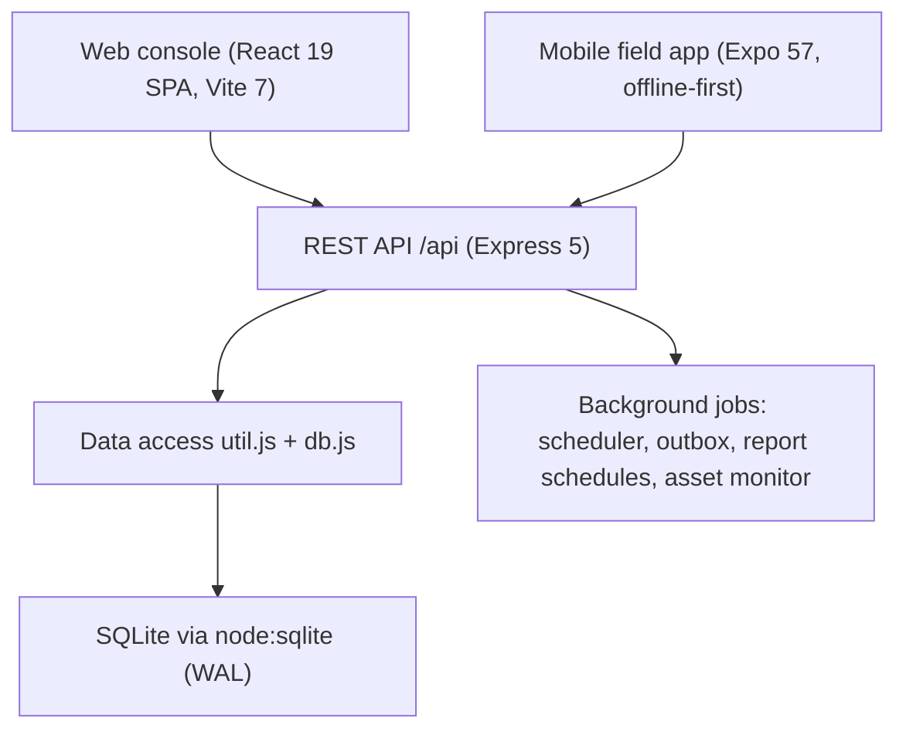

# TMMS Core Functional Modules, Verified Code Map and Engineering Standards

Transmission Maintenance Management System (TMMS).
As-built reference for developers: what each module does, exactly which
backend and frontend files implement it, how each change is verified, and the
standards every change must keep.

Companion documents:

- `TMMS_SPEC.md` — product specification (domain model, workflows, API intent).
- `docs/SYSTEM_MAP.md` — organisation, roles and task-bucket model.
- `docs/TASK_LIFECYCLE.md` — task state machine and capabilities.
- `docs/FUNCTION_INVENTORY.md` — function-by-function issue register (resolved).
- `docs/USER_MANUAL.md` — step-by-step use.

Where this document and the specification disagree, this document describes the
running code and wins for engineering decisions.

---

## 1. As-built architecture

The specification describes an aspirational PostgreSQL/PostGIS + WebSocket
deployment. The running system is a single-node, offline-friendly stack:



| Tier | Reality |
|---|---|
| Presentation (web) | React 19 + Vite 7, react-router 7, Tailwind 4, motion, lucide-react, vendored `src/ui` kit |
| Presentation (mobile) | Expo 57 / expo-router, expo-sqlite offline store, expo-secure-store, expo-location, expo-camera, MapLibre |
| Application | Express 5, CommonJS modules, route-per-domain under `backend/routes/` |
| Data | SQLite (`node:sqlite` `DatabaseSync`), WAL mode, `PRAGMA foreign_keys = ON`, 52 tables in `backend/db.js` |
| Async work | In-process intervals in `backend/server.js`: schedule generation, mail outbox, report schedules, asset-condition monitor |

Startup is idempotent: `initSchema()` + seeders/migrations run on every boot, so
a fresh clone and an existing database both converge (`backend/server.js:15`).

### Running the stack

```bash
# Backend on :3001
cd backend && node server.js

# Frontend on :5173 (proxies /api to :3001); this is the exposed preview port
cd frontend && npm run dev
```

`start.sh` runs both and exposes the frontend port.

---

## 2. Core functional modules

Each module is a vertical slice: schema + domain module + route file + web
surface (+ mobile where field capture applies). "Verified" means the module's
behaviour is covered by a command in section 4.

### 2.1 Module overview

| # | Module | Backend | Web frontend | Mobile | Verify |
|---|---|---|---|---|---|
| 1 | Identity, sessions, RBAC | `auth.js`, `routes/auth.js`, `rolesMigrate.js`, `authority.js` | `auth.js`, `pages/Login.jsx`, `App.jsx` guards | `auth/` | backend tests + login flow |
| 2 | Organisation & operating model | `operatingModel.js`, `routes/org.js`, `seed_eep.js` | `pages/Organization.jsx`, `pages/OperatingModel.jsx` | — | `docs/SYSTEM_MAP.md` model |
| 3 | Regions, geo & geofencing | `geo.js`, `geofence.js`, `routes/core.js`, `routes/infrastructure.js` | `pages/Regions.jsx`, `pages/RegionSummary.jsx`, `components/PolygonEditor.jsx` | `map/` | backend tests |
| 4 | Substations | `routes/core.js`, `geo.js` | `pages/Substations.jsx`, `pages/SubstationSummary.jsx`, `components/SubstationMap.jsx` | — | Playwright substation checks |
| 5 | Transmission lines, towers, components | `routes/core.js`, `lineGeometry.js`, `lineWorkspace.js`, `lineInspection.js`, `inspectionTrace.js`, `towerComponents.js`, `towerStandards.js`, `integrity.js`, `infraImport.js`, `geoimport.js` | `pages/Lines.jsx`, `pages/Towers.jsx`, `pages/LineSummary.jsx`, `pages/LineMapWorkspace.jsx`, `components/LineWorkspaceMap.jsx` | `capture/trace` | backend tests |
| 6 | Assets, register & valuation | `routes/assets.js`, `routes/register.js`, `routes/catalog.js`, `assetCatalog.js`, `assetCondition.js`, `assetBaseline.js`, `assetPerformance.js`, `assetMonitor.js`, `assetImport.js` | `pages/Assets.jsx`, `pages/AssetsHub.jsx`, `pages/Value.jsx` | — | `assetPerformance.test.js`, `registerValuationCache.test.js` |
| 7 | Tasks & workflow engine | `routes/tasks.js`, `target.js`, `taskNumber.js`, `taskProgress.js`, `authority.js`, `integrity.js` | `pages/Tasks.jsx`, `pages/TaskDetail.jsx`, `pages/WorkHub.jsx`, `components/TaskRunner.jsx`, `components/TaskWorkPanel.jsx`, `components/WorkPanelOverlay.jsx`, `components/ExecutionDetail.jsx` | `task/`, `finding/`, `comment/`, `photo/` | runner/consistency Playwright + backend tests |
| 8 | Crews, dispatch & readiness | `routes/crews.js`, `crewStatus.js`, `assignment.js`, `dispatch.js`, `readiness.js` | `pages/Crews.jsx`, `pages/Certifications.jsx` | — | equipment readiness checks |
| 9 | Maintenance schedules | `routes/schedules.js`, `recurrence.js`, `scheduler.js` | `pages/Schedules.jsx` | — | backend tests |
| 10 | Checklists & execution | `routes/checklists.js`, `checklistCatalog.js`, `towerStandards.js` | `pages/Checklists.jsx`, `components/ChecklistItem.jsx`, `checklistFormat.js` | `checklist/`, `components/ChecklistItemInput.tsx` | mobile vitest + Playwright |
| 11 | GPS validation | `routes/gps.js`, `geofence.js`, `geo.js` | `pages/Gps.jsx` | `capture/gps` | mobile vitest |
| 12 | Reports, analytics & executive | `routes/reports.js`, `analytics.js`, `summary.js`, `maintenanceCost.js`, `executiveRecommendations.js`, `assetMonitor.js` | `pages/Reports.jsx`, `pages/ExecutiveSummary.jsx`, `pages/Value.jsx` | — | `summary.test.js`, exec briefing/recommendations tests |
| 13 | Mailbox & messaging | `routes/mailbox.js`, `mail.js` | `pages/Mailbox.jsx`, `pages/mailbox/useMailKeyboard.js`, `pages/mailbox/useSwipe.js` | `mail/` | `mailboxJunkTrash.test.js`, mobile `mailbox.test.ts` |
| 14 | Home feed & dashboard | `routes/home.js`, `routes/dashboard.js`, `homeFeed.js`, `summary.js` | `pages/Home.jsx`, `pages/Dashboard.jsx` | `app/(tabs)` | backend tests |
| 15 | Integrated map & GIS | `routes/map.js`, `geo.js`, `lineGeometry.js` | `pages/MapPage.jsx`, `components/StaticMap.jsx`, `MapPicker.jsx`, `MapLegend.jsx`, `mapBase.js`, `mapFocus.js` | `map/` | mobile `bbox.test.ts` |
| 16 | Admin, settings, search, attachments | `routes/admin.js`, `routes/search.js`, `routes/attachments.js`, `routes/comments.js` | `pages/AdminHub.jsx`, `pages/Settings.jsx`, `components/GlobalSearch.jsx`, `components/Comments.jsx`, `components/ImportDialog.jsx` | — | build + backend tests |

### 2.2 Module notes and code anchors

**1. Identity, sessions, RBAC.** Sessions are 32-byte hex tokens in the
`session` table; `requireAuth` attaches `req.user`/`req.token`
(`backend/auth.js:193`). The permission matrix is `ROLE_PERMS`
(`backend/auth.js:126`): `ADMIN` is wildcard; field roles get `FIELD_READS` +
capture perms; management roles get `OPERATIONS_WORKFLOW`; `PLANNER`/`DISPATCHER`
plan and hand off without verifying. Region scope is enforced by `inRegion`,
`checkRegion` and `scopeRows` (`backend/auth.js:165`, `:216`, `:225`); crew scope
by `isOnCrew`/`userCrewIds` (`backend/auth.js:81`, `:74`). `authority.js` holds
shared visibility/command-scope predicates (`taskVisible`, `commandScope`,
`authorizedCrewIds`).

**2. Organisation & operating model.** `operatingModel.js` is the single source
of truth binding org units to roles and task buckets; the same model is rendered
in-app and documented in `docs/SYSTEM_MAP.md`. Legacy department-head role names
remain valid aliases (`SUBSTATION_MANAGER`, `TRANSMISSION_MANAGER`,
`RELAY_SCADA_MANAGER`) and are migrated by `rolesMigrate.js`.

**3–5. Infrastructure.** `routes/core.js` owns regions, substations, lines,
towers and tower components. Geometry helpers are pure (`geo.js`,
`lineGeometry.js`, `inspectionTrace.js`) so they are unit-testable without a DB.
`lineWorkspace.js` mutations never call `rebuildLineRoute`: the line route is
master geometry and tower saves must not overwrite it. `infraImport.js` and
`assetImport.js` are pure parsers; the route layer resolves codes, enforces
scope and writes. `integrity.js` reconciles denormalised counts at boot.

**6. Assets & valuation.** `assetCatalog.js` is the controlled
family→type→subtype catalog. `assetCondition.js` derives evidence-based
condition; `assetBaseline.js`/`assetPerformance.js` compute age-adjusted health
and recommendations; `assetMonitor.js` is the revaluation agent invoked from
`server.js:112`.

**7. Tasks & workflow engine.** The state machine is
`DRAFT → SCHEDULED → ASSIGNED → IN_PROGRESS → PENDING_VERIFICATION → COMPLETED`
with `hold`/`resume`, `reopen`, `retrieve`, `cancel` (see
`docs/TASK_LIFECYCLE.md`). Transitions and gates live in `POST /tasks/:id/state`
(`backend/routes/tasks.js`, action handler around `:990`). Submit/verify are
blocked by `taskReadiness` checklist/equipment blockers
(`backend/readiness.js`). Task numbers are allocated via
`taskNumber.js` (SQL `MAX` scan, not a full JS scan). Crew execution uses the
advisory Equipment step (never blocks Start), checklist capture, GPS and photos
in `components/TaskRunner.jsx`.

**8. Crews, dispatch & readiness.** `assignment.js` is one scoring model shared
by assign-options ranking and schedule auto-assignment; `dispatch.js` matches
checklist crew composition, certifications and availability; `readiness.js`
answers "can this crew actually do this task" and is reused by the runner.

**10. Checklists.** `checklistCatalog.js` encodes the workbook-derived catalog.
The web inputs for `PASS_FAIL`, `YES_NO`, `SELECT` and `NUMERIC` are unified in
`components/ChecklistItem.jsx` (OK / Not OK buttons, one button per SELECT
option) so `TaskDetail`, `TaskWorkPanel`, `WorkPanelOverlay` and `TaskRunner`
render identically; read-only rendering goes through `checklistFormat.js`.
Mobile mirrors the labels in `mobile/src/components/ChecklistItemInput.tsx`.

**12. Reports, analytics & executive.** `reports.js` handles async report
generation, schedules and the asset monitor; `analytics.js` adds expert
evaluation; `summary.js` powers regional effectiveness/load/interventions and
executive tiles; `executiveRecommendations.js` ranks advisory interventions.
`pages/ExecutiveSummary.jsx` is the CEO/Admin briefing surface, gated by
`RequireExecutive`.

**13. Mailbox.** `routes/mailbox.js` (37 endpoints) plus `mail.js` implement
threads, labels, junk rules, saved searches, read state, outbox scheduling and
attachments. Read-state and counts are batched with chunked `IN (...)` queries
for performance; the outbox is swept on a 60s interval and lazily on reads
(`server.js:102`).

---

## 3. Standards that must be followed

### 3.1 Backend standards

1. **Module system.** CommonJS (`require`/`module.exports`). One route file per
   domain under `backend/routes/`. Pure logic (geometry, recurrence, import
   parsing, scoring) lives in a separate DB-free module so it is unit-testable.
2. **Data access only through `util.js`.** Use `list`, `get`, `insertRow`,
   `updateRow`, `safeDelete`, `withTx`, `nextCode`, `parsePage`/`paginate`
   (`backend/util.js`). Do not hand-write SQL in route files when a helper fits;
   when you must, prepare statements via `prep` to avoid re-parsing.
3. **Schema changes are additive and idempotent.** Add `CREATE TABLE IF NOT
   EXISTS` in `db.js` `initSchema()` and, for a new column, a guarded
   `migrate(table, column, alterSql)` call (`backend/db.js:1016`). Never edit an
   applied migration destructively; boot must succeed on both fresh and existing
   DBs.
4. **Wrap multi-row writes in a transaction.** Use `withTx(fn)`. A logical unit
   (create parent + children, cascade delete, GPS validation plus asset update,
   follow-up creation) commits or rolls back together.
5. **Authorize before you read or write.** Reads apply visibility
   (`taskVisible`, `scopeRows`, crew scope); writes call `requirePerm`/`can` plus
   `checkRegion` or crew membership. Never trust a client-supplied region, crew,
   actor (`executed_by`), task number, status or result — derive or validate it.
6. **Whitelist writable fields.** Do not spread `req.body` into an insert or
   update; construct the column object explicitly (mass assignment is a security
   defect).
7. **Audit non-fatally.** Mutations are logged by `auditMiddleware`; keep large
   payloads (attachments, GPS blobs) out of the log via the redaction keys.
8. **Avoid N+1 and full-table scans on list endpoints.** Batch lookups
   (`IN (...)`), add SQL aggregate/`MAX` where a JS scan existed, and keep list
   response shapes byte-identical when optimising.
9. **Deterministic ordering.** Any query that picks "the" row (e.g. a user's
   crew) must `ORDER BY` with an explicit rule.

### 3.2 Frontend (web) standards

1. **Stack.** React 19 function components, hooks; Vite 7; Tailwind 4 (via
   `@tailwindcss/vite`); `motion/react` for animation; `lucide-react` icons;
   `react-router-dom` 7.
2. **Routes and guards.** Register pages in `frontend/src/App.jsx`; guard with
   `RequireAuth`, `RequireExecutive`, `RequireAdmin`, `BlockExecutive`,
   `RequireReportAccess`. Lazy-load heavy surfaces with `lazy(() => import(...))`
   wrapped in `<Suspend>`. Preserve existing routes and guards.
3. **Data access through `api.js`.** GETs use the stale-while-revalidate cache
   (5s fresh / 300s stale, deduped for StrictMode); any write invalidates the
   cache. Do not call `fetch` directly.
4. **Shared UI kit.** Use `frontend/src/ui` (`Button`, `Card`, `Badge`, `Sheet`,
   `Tabs`, `Tooltip`, `Command`, `Skeleton`, `cn`) and the `components.jsx`
   barrel (`Page`, `Modal`, `StatCard`, `Empty`, `ErrorNote`, `Loading`,
   `PageSkeleton`, `Pill`, `CondPill`, `MoneyCard`, `SearchSelect`). Do not
   introduce a parallel design language.
5. **Theming.** Light and dark tokens only; no hard-coded one-off colours that
   break dark mode.
6. **Accessibility.** Icon-only controls need `aria-label`; overlays need a
   keyboard-close path (Escape) and focus handling.
7. **Motion.** Respect `prefers-reduced-motion`; animation must never be the
   only signal of state.
8. **No dead code.** Remove unused state, effects, helpers and imports with the
   change that makes them unused.

### 3.3 Mobile standards

1. Expo 57 / expo-router; TypeScript strict enough for `tsc --noEmit`.
2. Offline-first: writes go through `src/sync/engine` (queue + reconciliation by
   client ref), local state in expo-sqlite (`src/db`), secrets in
   expo-secure-store.
3. Field capture modules (`src/capture/*`) stay pure and unit-tested where
   possible; permissions for camera/location handled via Expo.
4. Keep checklist labels and semantics aligned with the web `ChecklistItem`.

### 3.4 Internationalisation standard (all web surfaces)

- Base strings live in `frontend/src/i18n.js` under `STR.en`; translate for
  `es` and `zh` in the same object, and call `t('key')`.
- The Amharic runtime works by DOM phrase substitution
  (`frontend/src/phrases.am.js`): **the key must match the rendered text
  exactly**, including case and punctuation. When you add or change a user-visible
  English string, add the Amharic phrase for it.
- Never hard-code user-visible text in a component without a `t()` key when an
  equivalent exists.

### 3.5 Security standards

- Enforce RBAC and region/crew scope server-side on every request; the client is
  never an authorization boundary.
- Derive the acting person from `req.user`; ignore client-supplied identity.
- Validate enum/foreign-key inputs (`crew_id`, `result`, statuses) before use.
- Do not log secrets or large blobs; do not commit secrets, DB files, WAL/SHM
  files, uploaded media or build output.
- Guard high-risk outputs: reports/attachments are permissioned; SQL is
  parameterised through prepared statements.

### 3.6 Code quality standards

- Functionality and correctness first: handle null/empty/single-element and
  concurrent cases; do not regress existing behaviour.
- Single responsibility; no premature abstraction; DRY the second time you copy.
- Clear names; no comments unless they explain "why"; remove dead code.
- Match surrounding style; no debugging output left behind.

### 3.7 Git and change workflow standards

- Work on the feature branch; do not commit to a protected branch directly.
- Stage explicit paths (`git add <path>`); never `git add -A`.
- Never commit `backend/tmms.db*`, `backend/tmms1.db-*`, `backend/uploads/`,
  `frontend/dist/`, `design/` or generated mobile artifacts.
- Commit messages follow the project convention, e.g.
  `feat(executive): show substation count on assets tile; drop substation detail list`.
- No `.gitmodules` exists today; if submodules are ever added, commit each
  submodule on its own branch before updating the parent reference.
- Do not commit, amend or push unless the user asked for it.

---

## 4. Verification: checked and verified code

Run these before claiming a change is done. A change is "verified" when the
relevant commands pass and a browser check confirms the user-visible result.

### 4.1 Commands

```bash
# Backend: run the domain test suite (node:test)
cd backend && node --test "test/*.test.js"

# Frontend: production build must succeed (also type/lint via the toolchain)
cd frontend && npm run build

# Mobile: type check then unit tests
cd mobile && npx tsc --noEmit && npx vitest run

# Stack health
curl -s http://localhost:3001/api/health
```

### 4.2 Backend test coverage (current)

`backend/test/` covers the modules most likely to regress:

| File | Covers |
|---|---|
| `assetPerformance.test.js` | age baselines, health, recommendations |
| `executiveBriefing.test.js` | regional effectiveness, load, interventions, concentration |
| `executiveRecommendations.test.js` | recommendation ranking/severity |
| `mailboxJunkTrash.test.js` | junk/trash lifecycle |
| `registerValuationCache.test.js` | register valuation cache |
| `summary.test.js` | regional summaries |

### 4.3 Mobile test coverage (current)

`mobile/src/**/*.test.ts` under vitest (node env): `api/client`, `capture/geo`,
`capture/photo`, `capture/trace`, `capture/gps`, `db/queries`, `db/schema`,
`mail/mailbox`, `map/bbox`, `sync/engine`.

### 4.4 Browser verification (Playwright, headless)

UI behaviour that has no unit test is checked with a throwaway Playwright script
against the running stack (frontend `:5173`, backend `:3001`):

```js
import pw from '/usr/local/lib/node_modules/playwright/index.js';
const { chromium } = pw;
const auth = await (await fetch('http://localhost:3001/api/auth/login', {
  method: 'POST', headers: { 'content-type': 'application/json' },
  body: JSON.stringify({ username: 'admin', password: 'Admin@123' }),
})).json();
const ctx = await (await chromium.launch()).newContext({ viewport: { width: 1440, height: 1000 } });
await ctx.addInitScript(([t, u]) => {
  localStorage.setItem('tmms_token', t);
  localStorage.setItem('tmms_user', JSON.stringify(u));
  localStorage.setItem('tmms_theme', 'light');
}, [auth.token, auth.user]);
```

Assert on rendered text/structure, screenshot the result, and record the outcome.

### 4.5 Verified modules on this branch (260928-feat-mailbox-reports-schedules)

| Change | Verified by | Result |
|---|---|---|
| Crew runner UX: OK/Not-OK buttons, multi-photo (camera + gallery), X close, Done | `verify-runner-ux.mjs` | 13/13 |
| Advisory Equipment step (never blocks Start) + `answered` readiness flag | `verify-equipment.mjs` | 7/7 |
| Checklist input consistency across TaskDetail/WorkPanel/TaskRunner + mobile labels | `verify-consistency.mjs` | 5/5 |
| Executive "Assets in service" tile shows substation count; Asset portfolio drops the SS detail list | `verify-sub-count.mjs` | tile `13 regions · 84 lines · 169 substations`; drawer has Substations stat, zero `SS-*` rows |
| Mailbox read-state/count batching | backend tests | pass, byte-identical output |
| Backend suite / mobile suite | `node --test`, `tsc`, `vitest` | 44/44 backend, 37/37 mobile |

---

## 5. Invariants that must not be broken

- **Task ownership is exclusive.** A task with a crew is `ASSIGNED`, never merely
  `SCHEDULED`; the verifier cannot be the executor.
- **Buckets stay separate.** Home renders one section per owned bucket; never
  merge schedule/assign/execute/verify into one queue.
- **Region scope is server-enforced.** `inRegion` denies a null region for
  non-global users; crew users see only their crew and region.
- **Evidence is append-only.** `checklist_execution`, `gps_validation`,
  `asset_maintenance_event` and report artifacts are not rewritten.
- **The line route is master geometry.** Saving towers must not regenerate or
  overwrite the line route.
- **Boot is idempotent.** Seeders and migrations converge; re-running is safe.
- **Master-data writes are ADMIN-only.** Management roles run the task workflow;
  crews capture evidence.

---

## 6. Change checklist

Before opening a change for review:

1. Schema change? Added `CREATE TABLE IF NOT EXISTS` / guarded `migrate`; boot
   tested on existing DB.
2. Writes grouped in `withTx`; authorization + scope checked; fields whitelisted.
3. List endpoints batched (no new N+1 / full scan).
4. Web: route + guard preserved, `ui`/`components.jsx` reused, light+dark fine,
   `aria-label` on icon controls, motion respects reduced motion.
5. i18n: English key added, `es`/`zh` translated, Amharic phrase added to match
   rendered text exactly.
6. No dead code left behind.
7. `backend node --test`, `frontend npm run build`,
   `mobile npx tsc --noEmit && npx vitest run` all pass; browser check done for
   user-visible changes.
8. Commit staged by explicit path with a conventional message; no secrets or
   generated files included.
