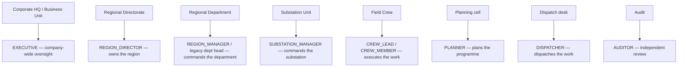
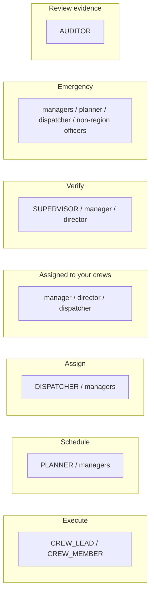
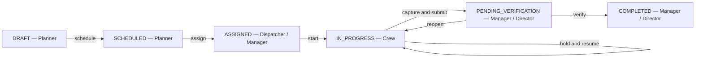
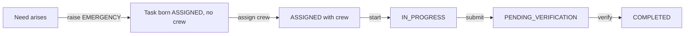

# TMMS System Map: Organisation, Roles and Task Flow

Transmission Asset Management System (TMMS)
A pictorial clarification of who does what, so scheduling, assignment,
execution and verification never mix.

Companion to `docs/TASK_LIFECYCLE.md` (state machine details) and
`docs/USER_MANUAL.md` (step-by-step use).

---

## 1. One function per role

The organisation, the account roles and the task views are three faces of the
same model. Each band heads one thing, and its role leads with one task bucket.

| Organisation band | Units (seeded) | Role | Function | Leads with |
|---|---|---|---|---|
| Corporate HQ / Business Unit | CEO, Transmission Business Unit, Divisions | `EXECUTIVE` | Company-wide oversight | Oversight |
| Regional Directorate | Central 1 … Western Region | `REGION_DIRECTOR` | Owns the region | Assign + Verify |
| Regional Department | Substation O&M, Line & OPGW, RTU/SCADA/Telecom | `REGION_MANAGER` and legacy `SUBSTATION_MANAGER`, `TRANSMISSION_MANAGER`, `RELAY_SCADA_MANAGER` | Commands the department | Assign + Verify |
| Substation Unit | Substation Management | `SUBSTATION_MANAGER` | Commands the substation | Assign + Verify |
| Field Crew | O&M, line and functional crews | `CREW_LEAD`, `CREW_MEMBER`, `FIELD_CREW` | Executes the work | Execute |
| Planning cell | Maintenance planning | `PLANNER` | Plans the programme | Schedule |
| Dispatch desk | Regional dispatch | `DISPATCHER` | Dispatches work | Assign |
| Audit | Independent audit | `AUDITOR` | Independent review | Review evidence |

`SUPERVISOR` is an operational-supervision role within a department; it leads
with Verify. `ADMIN` and `VIEWER` sit outside the operational bands (system
administration and read-only oversight).

---

## 2. The task buckets, kept separate

Every signed-in user gets only the buckets their role owns. They are rendered as
separate, labelled sections on Home, never merged into one queue.

| Bucket | Owner role(s) | Contents | Action |
|---|---|---|---|
| **My work — execute** | `CREW_LEAD`, `CREW_MEMBER`, `FIELD_CREW` | Tasks assigned to the user's crew (ASSIGNED, IN_PROGRESS, ON_HOLD) | start / capture / submit |
| **To schedule** | `PLANNER`, managers, directors, executives, admin | DRAFT work awaiting the calendar | schedule |
| **To assign** | `DISPATCHER`, managers, directors, executives, admin | SCHEDULED or unassigned ASSIGNED work with no crew | assign |
| **Assigned to your crews** | managers, directors, dispatcher, planner, executives, admin | Work already handed to crews the user commands (SCHEDULED/ASSIGNED/IN_PROGRESS/ON_HOLD) | open / monitor / reassign |
| **To verify** | `REGION_DIRECTOR`, `SUPERVISOR`, `REGION_MANAGER` and legacy, executives, admin | PENDING_VERIFICATION work | verify |
| **Emergency** | managers, `PLANNER`, `DISPATCHER`, non-region officers | Open EMERGENCY tasks | raise / assign |
| **Review evidence** | `AUDITOR` | Pending verifications, read-only | review |
| **Oversight** | `EXECUTIVE`, `ADMIN`, `VIEWER` | Critical overdue work, GPS violations, expiring certifications | review |

A role may own more than one bucket, but the buckets are shown as separate
sections; that is what removes the "mix" of tasks to schedule, assign, execute
and verify.

Every bucket is also filtered by `taskVisible`, so a department manager only
ever sees the work its department owns: tasks on crews it commands, tasks it
raised, and unassigned work whose target is in its department's domain
(substation vs transmission line vs relay/SCADA/telecom). A tower/line task is
invisible to the relay or substation manager and vice versa. The **region
director** is the region-wide reader (the region is their "global"), while the
directory surfaces — crews, people, certificates, org tree, map and
infrastructure — stay region-wide for a region manager.

### Sub-categories inside a bucket

An expanded bucket can be broken into sub-categories by **status** (assigned /
in progress / on hold …), **task type**, **substation**, **transmission line**
or **asset category**. The Home card fetches the full bucket once from
`GET /home/bucket/:key` (the same `bucketRows` membership as the count on the
card, so they can never diverge) and each task carries a `facets` object
resolved from its target — a direct `substation_id`/`line_id`, or the asset it
belongs to, or the tower's line. Sub-categories are collapsible and keep the
task urgency order; the endpoint is limited to buckets the caller's role owns,
so grouping never widens what `/home` exposes.

---

## 3. Lifecycle with its owner at every step

- **Planner** puts DRAFT work on the calendar.
- **Dispatcher / Manager** assigns it to a crew inside their authority.
- **Crew** starts, captures the checklist, GPS and photos; the crew lead submits.
- **Manager / Director** verifies; a checklist or GPS gate blocks completion until
  the evidence is complete, and the verifier cannot be the person who executed.
- **Cancel** is available to managers at any open stage.

A task that carries a crew is **ASSIGNED**, never merely SCHEDULED: the only way
a task reaches a crew is through the assignment handoff. This keeps planned work
with a responsible crew visible to that crew (under "My work — execute") and to
its command chain (under "Assigned to your crews"), instead of falling out of
every list.

---

## 4. Emergency path

Emergency work skips DRAFT and SCHEDULED. It can be raised by managers,
executives, the Planner/Dispatcher and non-region officers. Field crews cannot
create any task, emergency or otherwise, and always receive work through
assignment.

---

## 5. Where the model appears in the app

- **Home** — the user's function banner plus one card per owned bucket, each card
  expanding to its tasks and, inside that, to collapsible sub-categories (status,
  task type, substation, line, asset category).
- **Tasks** — the full task list, with the emergency raise form reachable from the
  Emergency bucket.
- **Organization** — each unit shows its function and the role that heads it.
- **System map** — this model rendered in-app, under Governance (or the crew menu).

The single source of truth in code is `backend/operatingModel.js`; the account
capabilities are in `backend/auth.js` and the transitions in
`backend/routes/tasks.js`.
