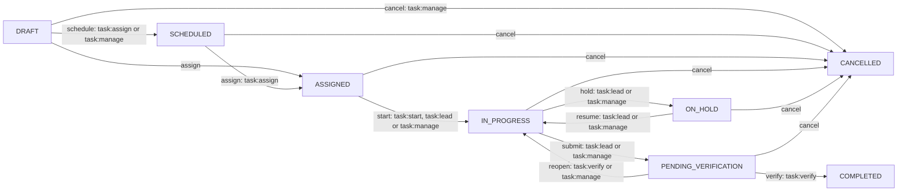
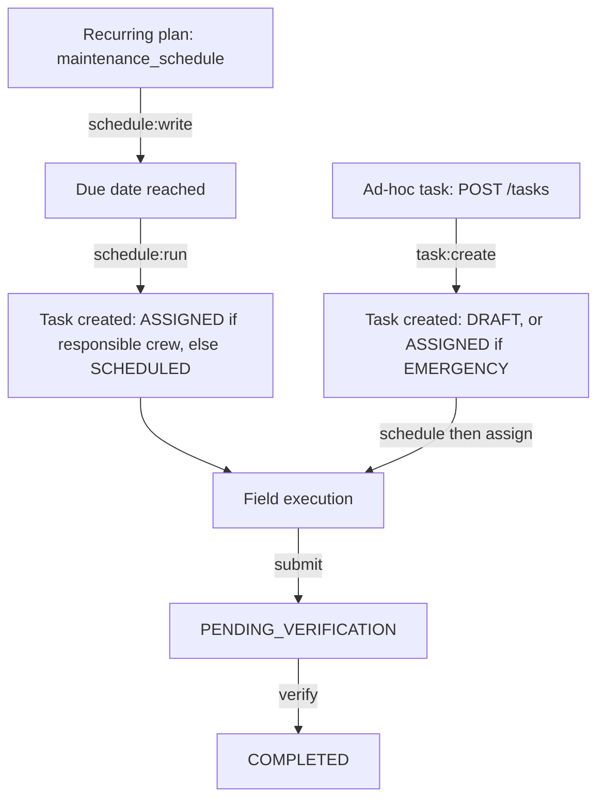

# TMMS Task Lifecycle: Scheduling, Assignment, Execution

Transmission Asset Management System (TMMS)
Who plans, who dispatches, who does the work, and who signs it off.

---

## About this document

This is a reference for the operational core of TMMS: the maintenance and
inspection task. It describes the states a task moves through, the role that
owns each step, and the guardrails the server enforces. It reflects the code in
`backend/routes/tasks.js`, `backend/routes/schedules.js`, `backend/auth.js` and
`backend/authority.js`.

Read this together with `docs/USER_MANUAL.md` (task-by-task operating steps) and
`docs/FUNCTION_INVENTORY.md` (module inventory).

---

## 1. The three planning concepts

TMMS uses three related but distinct ideas. Confusing them is the most common
source of questions, so keep them apart:

| Concept | Stored on | Created by | Meaning |
|---|---|---|---|
| **Maintenance schedule** | `maintenance_schedule` | `schedule:write` | A recurring plan (monthly, weekly, custom) over a scope: region, substation, line, line towers, asset class, tower or asset. |
| **Schedule generation** | `POST /schedules/run` | `schedule:run` | Turning one or more due plans into concrete tasks. Generated from the plan's targets. |
| **Task status `SCHEDULED`** | `task.status` | `task:assign` / `task:manage` | The lifecycle state meaning "planned, not yet dispatched". Unrelated to the plan record above. |

A schedule may name a **responsible crew**. When a generation runs and a
responsible crew is set, the generated task is created **ASSIGNED** directly.
Without a responsible crew the task is created **SCHEDULED** and waits for a
dispatcher.

---

## 2. Task states and transitions

Defined in `task.transitions` (`backend/routes/tasks.js`):

Two special cases:

- **EMERGENCY tasks** skip the plan states: `POST /tasks` creates them directly
  in **ASSIGNED** (with or without a crew).
- **Assigning an unassigned ASSIGNED task** is allowed, so an EMERGENCY created
  without a crew can still be given one. A task that already carries a crew is
  **not** reassigned through this transition; change its crew before work starts
  via `PUT /tasks/:id` (`task:manage`).
- **A task that already carries a crew is never left in SCHEDULED.** Scheduling a
  draft that already names a crew lands directly on **ASSIGNED**, and any
  historical `SCHEDULED` row that carries a crew is normalised to `ASSIGNED` on
  startup. A SCHEDULED-with-crew row would otherwise belong to no role's task
  list: too late for "to schedule", already crewed for "to assign", and not yet
  started for "to execute".

---

## 3. Who holds which capability

Capabilities are fixed per role in `backend/auth.js`. "Legacy" department-head
roles (`SUBSTATION_MANAGER`, `TRANSMISSION_MANAGER`, `RELAY_SCADA_MANAGER`) are
aliases of `REGION_MANAGER`.

| Role | Create task | Author schedule | Run generation | Schedule transition | Assign crew | Start | Capture checklist | Submit run | Verify | Cancel / reopen |
|---|---|---|---|---|---|---|---|---|---|---|
| `ADMIN` | yes | yes | yes | yes | yes | yes | yes | yes | yes | yes |
| `EXECUTIVE` | yes | yes | yes | yes | yes | yes | no | yes | yes | yes |
| `REGION_DIRECTOR` | yes | yes | yes | yes | yes | yes | no | yes | yes | yes |
| `SUPERVISOR` | yes | yes | yes | yes | yes | yes | no | yes | yes | yes |
| `REGION_MANAGER` (and legacy) | yes | yes | yes | yes | yes | yes | yes | yes | yes | yes |
| `PLANNER` | yes | yes | yes | yes | yes | yes | no | yes | no | yes |
| `DISPATCHER` | yes | no | yes | yes | yes | no | no | no | no | no |
| `CREW_LEAD` / `FIELD_CREW` | no | no | no | no | no | yes | yes | yes | no | no |
| `CREW_MEMBER` | no | no | no | no | no | yes | yes | no | no | no |
| `AUDITOR` / `VIEWER` | no | no | no | no | no | no | no | no | no | no |

Notes:

- **Managers and `REGION_MANAGER` may capture checklist evidence** for the work
  they own (`task:execute`), in addition to the field crews.
- **`EXECUTIVE`, `REGION_DIRECTOR` and `SUPERVISOR` can force field transitions**
  (start, submit, hold, resume) through `task:manage`, but they cannot open or
  submit a checklist themselves because they do not hold `task:execute`. The
  checklist gate still blocks completion until a field run exists.
- **`CREW_MEMBER` starts and captures but never submits**: the run advances to
  `PENDING_VERIFICATION` only when the capture is submitted by someone with
  `task:lead` (crew lead) or `task:manage`.
- **Verification is never part of the field or dispatch role**: a dispatcher and
  a planner cannot verify, and the person who executed the checklist cannot
  verify the same task (segregation of duties).
- Master data (regions, substations, lines, towers, assets, checklists, users)
  remains **ADMIN-only**.

---

## 4. The four questions

### Who schedules?

- A **planner, manager, director or executive** authors a `maintenance_schedule`
  (`schedule:write`) with a scope, a recurrence and an optional responsible crew.
- A **planner, dispatcher, manager or executive** runs generation
  (`schedule:run`) to expand due plans into tasks.
- The lifecycle transition DRAFT to SCHEDULED (the "Schedule" button on a draft)
  is held by anyone with `task:assign` or `task:manage`.

### Who assigns?

`task:assign` or `task:manage`, and the chosen crew must be inside the actor's
**authority** (`canAssignCrew` into `authorizedCrewIds`):

- **Region director / executive / admin**: any crew.
- **Department manager**: only crews inside their org-unit subtree (or, for a
  functional OT manager, crews of functional type).
- **Planner / dispatcher**: crews of their own region.
- **Crew**: only its own crew, and it has no assign permission anyway.

`assigned_by` records the person who performed the assignment.

### Who executes?

The assigned crew. Both `CREW_LEAD` and `CREW_MEMBER` hold `task:execute` and
`task:start`:

1. **Start** the task (`task:start`): ASSIGNED to IN_PROGRESS.
2. **Run the checklist**: record readings, findings and photos. A capture by a
   crew member is saved but leaves the task IN_PROGRESS.
3. **Submit** the run (crew lead or management): IN_PROGRESS to
   PENDING_VERIFICATION. An INCOMPLETE run is never advanced; outstanding
   required items keep the task in progress.

### Who verifies?

`task:verify` only: admin, executives, directors, supervisors and region
managers. Verification is blocked until the checklist run is complete, GPS is
confirmed when the template requires it, and the verifier is not the person who
executed the checklist. On success the task becomes COMPLETED and the server
records the asset maintenance event, advances the recurrence and (when the
failure ratio exceeds the emergency threshold) raises an automatic EMERGENCY
follow-up.

---

## 5. Two ways work enters the system

- **Planned path**: author plan, let it come due, run generation. If the plan has
  a responsible crew the work lands already ASSIGNED; otherwise it needs an
  assign step.
- **Ad-hoc path**: create a task. EMERGENCY work is born ASSIGNED and only needs
  a crew; everything else starts DRAFT and goes through schedule then assign.

Duplicate protection: generation will not create a task for a schedule that
already has an open task, and a follow-up task never spawns another follow-up, so
the automatic chain cannot run away.

---

## 6. Guardrails the server always enforces

1. **Visibility** (`taskVisible`): a crew sees only its own crew's tasks; a
   department manager sees only the work its department owns — tasks on crews it
   commands, tasks it raised, and unassigned work whose target sits in its
   department's domain (substation/line vs relay/SCADA/telecom); the **region
   director** is the region-wide reader; admin/executive/auditor see all. The
   directory surfaces (crews, people, certificates, org tree, map and
   infrastructure) stay region-wide for a region manager.
2. **Assignment authority** (`canAssignCrew`): you can only dispatch to crews you
   command, even if you can read them.
3. **Checklist gate**: a task with a checklist template cannot be submitted or
   verified until a submitted run has every required item graded.
4. **GPS gate**: when the template requires GPS confirmation, a device-versus-
   finishing-place validation must exist before completion. A FAIL reading is
   kept on record for the verifier, never silently dropped.
5. **Segregation of duties**: the verifier of a task cannot be the person who
   executed its checklist.
6. **Advisory dispatch and readiness**: crew eligibility and equipment readiness
   are surfaced as warnings at assignment, not hard blocks.

---

## 7. Role walkthroughs

**A region manager plans a monthly substation inspection.**
Create the schedule (or a draft task) with a checklist template and the
responsible crew. When it is due, run generation. Because a crew is named, the
task appears ASSIGNED. The crew lead starts it, the crew captures the checklist,
the lead submits, and the manager verifies.

**A dispatcher handles an emergency.**
An EMERGENCY task is raised and appears ASSIGNED with no crew. The dispatcher
picks a crew from their region and assigns it, then the crew starts work. The
dispatcher cannot verify the result.

**A planner builds next quarter's programme.**
The planner authors schedules and drafts tasks, schedules them, and assigns
crews. When the work comes back it is submitted for verification by the field
lead, and a manager (not the planner) verifies it.

**A crew member performs the field capture.**
The member starts the assigned task, records readings, findings, GPS and photos.
The task stays in progress until the crew lead submits the run.

---

## 8. API reference

| Method and path | Capability | Effect |
|---|---|---|
| `POST /schedules` | `schedule:write` | Create a recurring plan |
| `PUT /schedules/:id` | `schedule:write` | Edit a plan |
| `POST /schedules/run` | `schedule:run` | Generate tasks for due plans |
| `POST /tasks` | `task:create` | Create a task (DRAFT, or ASSIGNED for EMERGENCY) |
| `PUT /tasks/:id` | `task:manage` | Edit task fields, including crew |
| `POST /tasks/:id/state` | per transition | Drive the lifecycle |
| `POST /tasks/:id/checklist` | `task:execute` | Record the field run and submit it (lead/manage) |
| `POST /tasks/bulk` | `task:bulk` | Bulk priority, due date, schedule start or assign |
| `POST /tasks/:id/follow-ups` | `task:manage` | Confirm recommended corrective follow-ups |

---

## 9. Recent improvements

- EMERGENCY tasks created without a crew can now be assigned instead of getting
  stuck in ASSIGNED (this was previously rejected with a 409 conflict).
- Generation pre-assigns a task when the plan names a responsible crew, removing
  the redundant manual handoff.
- `PLANNER` can now complete the assignment handoff (`task:assign`) it already
  controlled through `task:manage`; verification deliberately stays with
  management.
- `DISPATCHER` can now expand due schedules (`schedule:run`) in addition to
  creating and assigning work, while schedule authoring and verification remain
  outside the dispatch role.
