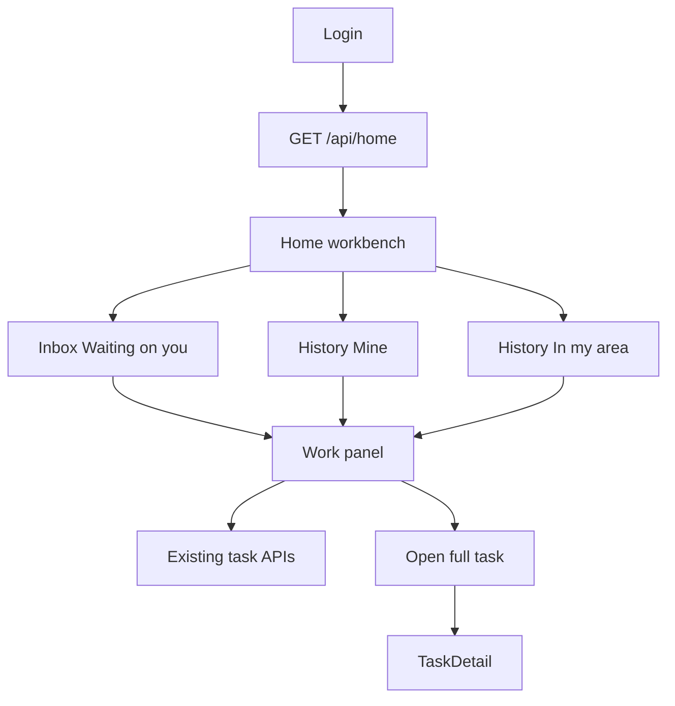

# Identity Workbench Home — Design

Status: approved (brainstorming complete)
Date: 2026-09-11

## 1. Summary

Replace the current persona-section Home with one Google-simple workbench for every role:

1. **Waiting on you** — a personal inbox of work that needs this user's next action.
2. **History** — two tabs, **Mine** and **In my area**, of recently closed work.
3. **Work panel** — opening a row runs the common next actions on Home itself (start, checklist, GPS, assign, verify), gated by existing permissions. Full Task Detail stays for print, dossier, follow-up, and route tracing.

Login still lands on `/home`. Landing and login are unchanged. Overview stays as the office dashboard and drops off the crew nav.

## 2. Background

- `GET /api/home` (`backend/routes/home.js`) returns `{ persona, name, role, sections[] }` with kinds `cards`, `task_queue`, `table`, `violations`, `schedule_list`, `cert_list`, `link_cards`. Crew sees assigned open tasks, certs, and a GPS link. Office roles see KPI walls and region dumps. There is no history.
- Frontend `Home.jsx` renders those sections generically. `App.jsx` `buildNav()` is the same full sidebar for every role. Post-login redirect is already `/home`.
- Task workflow already exists on `TaskDetail.jsx` via `POST /tasks/:id/state` (`schedule`, `assign`, `start`, `submit`, `hold`, `resume`, `verify`, `reopen`, `cancel`) plus checklist execute, GPS, attachments, findings. Permissions live in `backend/auth.js` / `frontend/src/auth.js`.
- Tasks stamp `created_by`, `assigned_by`, `verified_by` (person ids). Checklist runs stamp `executed_by`. Crew users resolve via `getUserCrew(user)`.

This spec supersedes the Home feed in `docs/superpowers/specs/2026-08-25-role-home-and-comments-design.md` section 3. Landing, comments, reports, and checklists from that spec stay.

## 3. Goals / Non-goals

Goals:

- Every signed-in role sees the same Home shape: inbox + history + work panel.
- Inbox is identity-scoped (waiting on *this* person), not a region dump.
- History has Mine and In my area.
- Common next actions run on Home without leaving the page.
- Crew chrome is Home + Map only. Office keeps the full sidebar.
- Reuse existing task/GPS/attachment APIs. No new execute endpoints.

Non-goals (YAGNI):

- Rewriting Overview, Landing, Login, or Task Detail.
- Deleting old pages; they stay reachable by URL.
- New frontend dependencies.
- Changing follow-up, route-editor, or bay-count rules.
- Offline / background GPS, push notifications, or a mobile-native shell.
- Inbox search, saved filters, or infinite scroll (cap 25).
- Inline print, dossier, follow-up create, or inspection-route map (those stay on Task Detail).

## 4. Architecture



Key decisions:

- **One payload, not persona section soup.** `GET /api/home` returns `inbox` + `history`. Persona only affects how those lists are filled and which chrome/actions the user gets.
- **Panel is a client of Task Detail APIs.** Opening a task row fetches `GET /tasks/:id` and posts to the same state/checklist/GPS/attachment routes Task Detail already uses.
- **Non-task exceptions are links, not a second panel.** Failed GPS and expired certs in an exec/auditor inbox navigate to `/gps` or `/certifications`. Only `kind: 'task'` opens the work panel.

## 5. Home layout

One screen, no KPI wall, no cert/GPS/schedule widgets on Home.

1. **Header** — greeting with display name, role label, and scope line (crew name for crew users; region name otherwise; "All regions" for global roles).
2. **Waiting on you** — ranked list. Empty copy: "You're clear."
3. **History** — tabs **Mine** | **In my area**. Empty copy: "No recent history."
4. **Work panel** — desktop: right-hand panel beside the lists. Narrow viewport: full-screen sheet. Closing the panel leaves the lists in place.

Each task row shows: task number, title, type, priority, status, due (overdue emphasized), where (asset / tower / line / substation name), crew name, one-line reason, one primary-action button.

Clicking the row or the primary action opens the panel for `kind: 'task'`. Clicking a `kind: 'gps'` or `kind: 'cert'` row goes to that page.

## 6. Inbox — Waiting on you

Not a region dump. Only items that need this user's next action. Cap 25. Sort: overdue first, then earliest `due_date`, then priority CRITICAL > HIGH > MEDIUM > LOW, then `id`.

### 6.1 Membership by role

| Role | Inbox items |
|---|---|
| CREW_MEMBER | Open tasks (`ASSIGNED`, `IN_PROGRESS`) with `crew_id` = my crew |
| CREW_LEAD, FIELD_CREW | Same as member, plus `ON_HOLD` on my crew (primary action Resume) |
| PLANNER | `DRAFT` in my region; `SCHEDULED` in my region with no `crew_id` |
| DISPATCHER | `SCHEDULED` in my region with no `crew_id`; `DRAFT` in my region |
| SUPERVISOR, SUBSTATION_MANAGER, TRANSMISSION_MANAGER, RELAY_SCADA_MANAGER, REGION_MANAGER, REGION_DIRECTOR | Overdue open tasks in my region; `PENDING_VERIFICATION` in my region; `SCHEDULED` in my region with no `crew_id` |
| AUDITOR | `PENDING_VERIFICATION` in scope (global); failed GPS validations in scope (last 30 days, cap shared with the 25) |
| EXECUTIVE, ADMIN | Exceptions only: open CRITICAL overdue; failed GPS (last 30 days); certifications expired or expiring in 90 days |
| VIEWER | Same exception set as executive, read-only (`primary_action` always `open`) |

Open task statuses: `DRAFT`, `SCHEDULED`, `ASSIGNED`, `IN_PROGRESS`, `ON_HOLD`, `PENDING_VERIFICATION`.

Region scope: `isGlobal(user)` sees all; otherwise `task.region_id === user.region_id`. Crew users never receive region dumps — only their crew's assigned/in-progress tasks.

A user with no crew and a crew role gets an empty inbox and header note "No crew assigned yet."

### 6.2 Item shape

```text
{
  kind: 'task' | 'gps' | 'cert',
  id,
  task_number,          // task only
  title,
  task_type,            // task only
  priority,             // task only
  status,
  due_date,             // task only
  overdue,              // boolean
  where,                // display string
  crew,                 // { id, name } | null
  reason,               // one-line why it is in this inbox
  primary_action,       // see 6.3
  href                  // gps -> /gps, cert -> /certifications; task omits
}
```

`reason` examples: "Assigned to your crew", "Overdue", "Needs verification", "No crew assigned", "Draft to finish", "GPS failed", "Cert expiring".

### 6.3 Primary action

Computed from current status + `hasPerm`, never a new permission:

| Status / kind | Preferred action | Requires | Button label |
|---|---|---|---|
| DRAFT | `schedule` | `task:assign` or `task:manage` | Schedule |
| SCHEDULED, no crew | `assign` | `task:assign` | Assign |
| ASSIGNED | `start` | `task:start` | Start |
| IN_PROGRESS, crew member | `capture` | `task:execute` | Continue |
| IN_PROGRESS, lead | `submit` | `task:lead` or `task:start` | Submit |
| ON_HOLD | `resume` | `task:lead` or `task:start` | Resume |
| PENDING_VERIFICATION | `verify` | `task:verify` | Verify |
| gps / cert / anything else | `open` | read | Open |

If the preferred permission is missing, `primary_action` is `open`. VIEWER is always `open`. The panel still shows every *allowed* secondary action; the button is only the next legal step.

## 7. History

Closed statuses only: `COMPLETED`, `FAILED`, `CANCELLED`. Last 30 days. Cap 25 per tab. Newest `actual_end` (fallback `updated_at`) first. Same row shape as inbox; `primary_action` is always `open`. History task rows open the panel read-only (see 8.3).

### 7.1 Mine

A closed task is mine if any of:

- Crew user: `task.crew_id === myCrew.id`
- `created_by`, `assigned_by`, or `verified_by` equals `user.person_id`
- A `checklist_execution` on the task has `executed_by === user.person_id`

If the user has no `person_id` and is not on a crew, Mine is empty.

### 7.2 In my area

- Crew: closed tasks in `myCrew.region_id` (if the crew has no region, use `user.region_id`)
- Region-scoped office roles: closed tasks with `region_id === user.region_id`
- Global roles (ADMIN, EXECUTIVE, AUDITOR, VIEWER): company-wide closed tasks

Mine is a subset of area when the user worked in-area; the tabs are independent queries, not client filters of one list.

## 8. Work panel

Opens for `kind: 'task'` from inbox or history. Loads `GET /tasks/:id` on open. Reuses Task Detail's existing calls. Does not embed the line-inspection map, dossier, comments thread, or follow-up creator.

### 8.1 Always shown

Task number, title, type, priority, status, due, where (region / line / tower / asset / substation), crew, checklist template name, the inbox `reason` (hidden on history), "Open full task" link to `/tasks/:id`.

### 8.2 Inline actions (inbox, permission-gated)

Reuse current endpoints and the same permission checks Task Detail uses:

- State: `POST /tasks/:id/state` for schedule, assign (crew picker from `GET /crews`), start, submit, hold, resume, verify (result + summary + optional cost), reopen, cancel
- Checklist: existing fetch + submit execution
- GPS: existing validation capture
- Photos / attachments: existing upload
- Findings: existing create (lead/amend as today)

CREW_MEMBER can capture checklist/GPS/photos on IN_PROGRESS; cannot start, submit, hold, or amend. Verify/cancel never appear for crew roles.

### 8.3 History rows

Read-only summary of the completed run (status, result, completion summary, last GPS result if present). Only "Open full task". No state changes, no new checklist run.

### 8.4 After an action

On success, refetch `GET /tasks/:id` into the panel and refetch `GET /api/home` so completed/verified items leave the inbox. On 403/409, show the API error in the panel; do not close it.

## 9. API

Replace the body of `GET /api/home`. Route path, auth, and mount stay.

```text
{
  name, role, persona,
  scope: { crew: { id, name } | null, region: { id, name } | null, global: boolean },
  inbox: [ HomeItem ],
  history: { mine: [ HomeItem ], area: [ HomeItem ] }
}
```

`persona` stays the current mapping (`crew` / `planner` / `manager` / `auditor` / `executive` / `viewer`) so the client can slim the nav without re-deriving role sets.

No new routes for execute. Panel uses:

- `GET /tasks/:id`
- `POST /tasks/:id/state`
- existing checklist, GPS, attachment, finding, crews list endpoints as Task Detail does today

Do not initialize or write the real `backend/tmms.db` in verification. Scratch DB via `TMMS_DB=/tmp/...`.

## 10. Chrome

Crew roles (`CREW_LEAD`, `CREW_MEMBER`, `FIELD_CREW`):

- Sidebar: Home (`/home`) and Map (`/map`) only
- `/overview` and other pages remain routed; they are not in the nav
- Unknown authenticated paths still redirect to `/home`

Office roles:

- Current full sidebar, Home first, then Overview, Map, infrastructure, operations, compliance, management, governance
- Overview unchanged

Landing (`/`) and Login unchanged. Authenticated `/` still goes to `/home`.

Frontend: rewrite `Home.jsx`; `buildNav()` in `App.jsx` branches on `isCrewUser`; add work-panel styles in `styles.css`. Extract a small panel that calls the same `api` helpers as Task Detail rather than importing Task Detail. No new npm packages.

## 11. Error handling

- `GET /api/home` failure: existing `ErrorNote` on the page, no fake lists
- Missing crew for a crew user: empty inbox, scope.crew null, header "No crew assigned yet"
- Task no longer readable when opening the panel: error in the panel, list unchanged
- Stale inbox row (task already moved): state POST error shown; Home refetch drops it

## 12. Files touched

- `backend/routes/home.js` — replace `feedFor` with inbox + history builders; keep the router
- `frontend/src/pages/Home.jsx` — workbench UI
- `frontend/src/App.jsx` — crew vs office `buildNav`
- `frontend/src/styles.css` — workbench + panel
- Optional: `frontend/src/components/` for the work panel if Home would exceed a readable size; no new dependencies

## 13. Verification

- `node --check` on changed backend files
- Scratch server with `TMMS_DB=/tmp/tmms-home.db` (never the real db file): `GET /api/home` as crew lead, crew member, planner, manager, auditor, exec — confirm inbox membership, caps, history tabs, no `sections` key
- Crew login: sidebar is Home + Map; office login: full sidebar
- Work panel: start / checklist / GPS / submit / verify against scratch data using existing endpoints; history row does not expose those actions
- `npm run build` in `frontend` exits 0
- Kill scratch server by background terminal id, never `pkill`

## 14. Open questions resolved in brainstorming

- Home is for every role, same shape, identity-scoped
- History is both Mine and In my area
- Common field/office actions run on Home; deep tools stay on Task Detail
- Inbox is a personal waiting-on-you queue, not a role-shaped dashboard
- Crew gets slim nav; office keeps full chrome
