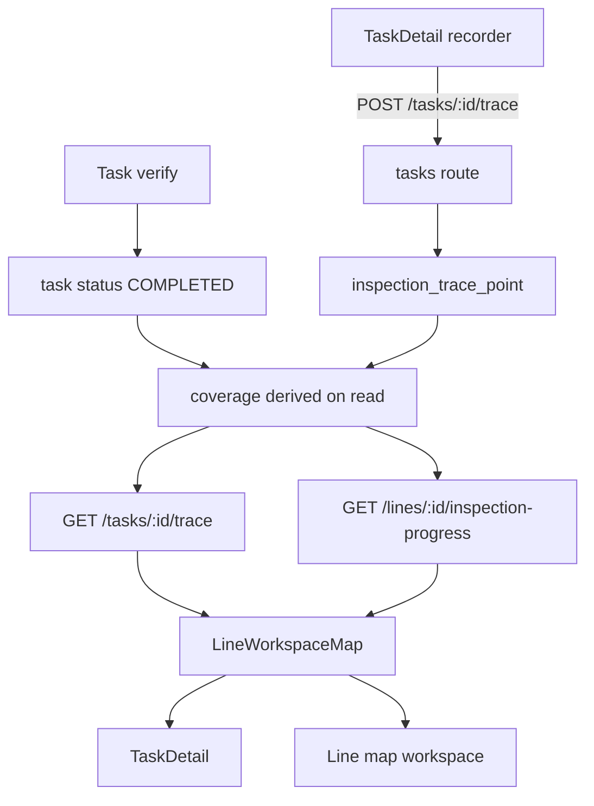

# Line-Inspection Route Tracing — Design

Status: approved (brainstorming complete)
Date: 2026-09-11
Sub-project: E (of the six-capability workstream)

## 1. Summary

Give line-inspection work two connected capabilities:

1. **GPS breadcrumb capture** — a crew member explicitly starts and stops route
   recording while working a line task; sampled device positions are persisted.
2. **Inspected-progress overlay** — as line tasks are verified as completed, the
   planned line route shows which towers and which stretches (km) have been
   inspected.

The trace and the progress overlay are shown both on the task detail page and as
an aggregate layer in the line map workspace.

Both tower coverage and km coverage are exposed.

## 2. Background

- Line geometry is the master route stored in `transmission_line.route_json` (a
  JSON array of `[lat,lng]`). Towers carry `km_marker`, `latitude`, `longitude`,
  and are always ordered by `ORDER BY km_marker, id`.
- `backend/lineGeometry.js` already provides pure helpers: `haversineKm`,
  `routeSegments`, `distanceAlongRoute`, `interpolate`, `projectPointToRoute`,
  `spaceAlongRoute`.
- `checklist_execution` stores only a single finishing GPS point
  (`gps_lat`/`gps_lng`/`gps_accuracy_m`) and no `line_id`.
- `frontend/src/components/LineWorkspaceMap.jsx` is self-contained (no API
  calls) and renders the route polyline plus tower markers; it is reusable.
- Task verification happens in `POST /tasks/:id/state` (action `verify`), which
  calls `applyCompletionSideEffects`. Task completion is the authoritative signal
  for "inspected".
- There is currently **no** traversed-path or track entity anywhere, and no
  materialized progress state.

## 3. Goals / Non-goals

Goals:

- Capture and persist a task's actual walked GPS path.
- Derive inspected tower coverage and inspected km coverage from verified task
  completion.
- Render the planned route, the actual trace, and the inspected overlay on both
  the task detail page and the line workspace.
- Keep geometry and coverage math in a pure, independently checkable module.

Non-goals (YAGNI):

- Background/automatic tracking, offline queues, or trace upload after the page
  closes.
- Trace editing or deletion, and downsampling/simplification of stored points.
- Using the trace to gate or change task verification.
- Any change to `checklist_execution` or its GPS semantics.

## 4. Architecture



Key decisions:

- **Approach A: dedicated trace table + derived coverage.** One new table
  (`inspection_trace_point`); coverage is computed at read time from verified
  tasks plus the line route and towers. No materialized coverage state.
- A pure module `backend/inspectionTrace.js` holds all coverage math and point
  validation; routes and the scheduler-free read paths only orchestrate DB
  access.

## 5. Data model

One new table, created through the existing idempotent `migrate()` helper
(`backend/db.js`), never destructive DDL:

### 5.1 `inspection_trace_point`

| Column | Type | Notes |
| --- | --- | --- |
| `id` | INTEGER PK | |
| `task_id` | INTEGER NOT NULL | the task being worked |
| `line_id` | INTEGER | denormalized from the task for per-line queries |
| `lat` | REAL NOT NULL | |
| `lng` | REAL NOT NULL | |
| `accuracy_m` | REAL | nullable |
| `km` | REAL | arc distance along `route_json`; null when no route |
| `recorded_at` | TEXT NOT NULL | ISO timestamp from the device |
| `created_at` | TEXT NOT NULL | server receive time |
| `crew_id` | INTEGER | nullable |

Indexes: `(task_id)`, `(line_id)`.

No existing table is altered.

## 6. Coverage semantics

Derived on read; nothing is materialized.

Definitions:

- An **inspected tower** is a tower on the line that has at least one task with
  `tower_id` = tower, `line_id` = line, and `status = 'COMPLETED'`.
- A completed **LINE-scope** task (`line_id` = line, `tower_id IS NULL`,
  `status = 'COMPLETED'`) covers the entire line (all towers inspected, km
  coverage 100%).
- Only `COMPLETED` (verified) tasks count toward coverage.

Metrics:

- `tower_progress = inspected_towers / total_towers` (towers ordered by
  `km_marker, id`).
- **Km coverage**: order towers by km; a segment between two consecutive towers
  is covered only when **both** bounding towers are inspected. `inspected_km` is
  the summed length of all covered segments; a lone inspected tower contributes
  0 km. `km_progress = inspected_km / total_km` (0 when the line has no route or
  fewer than two towers).
- `covered_spans`: the km intervals of the covered segments.
- `covered_paths`: server-computed `[lat,lng]` polylines for those spans, via
  `interpolate` on the route, so the frontend draws without geometry logic.

## 7. Capture

### 7.1 UX (TaskDetail)

- A **Record route** Start/Stop control, shown when `task.line_id` is set, the
  task is not `COMPLETED`, and the user is the assignee or has task-write
  permission.
- A small `useRouteRecorder` hook uses `navigator.geolocation.watchPosition`.
  A sample is accepted when it moved at least **10 m** from the last accepted
  point; updates faster than ~1 s are throttled.
- Accepted points buffer in memory and flush every ~15 s or 25 points, and on
  Stop.
- Live readout: recording state, captured point count, last accuracy. If
  geolocation is denied/unavailable, show a clear message and keep the control
  inactive.
- No background tracking and no offline queue: an unsent buffer is lost if the
  page closes.

### 7.2 `POST /tasks/:id/trace`

- Body: `{ points: [{ lat, lng, accuracy_m?, recorded_at? }], crew_id? }`.
- Permission/scope mirrors checklist submission (`POST /tasks/:id/checklist`):
  `taskVisible(req.user, t)` else 404; `can(req, 'task:execute')` else 403; a
  crew user may only record against their assigned task
  (`t.crew_id === req.user.crew_id`) else 403. Region scoping follows the task.
- Validation: `points` must be 1..500 entries; `lat` in -90..90; `lng` in
  -180..180; `accuracy_m` (if present) >= 0; `recorded_at` (if present) a valid
  ISO timestamp (defaults to server now). Violations return 400 with a specific
  message.
- Requires `task.line_id`; resolves the line route and computes `km` per point
  with `projectPointToRoute`. When the line has no route, `km` is stored null.
- Returns `{ inserted }`.

## 8. Read APIs

### 8.1 `GET /tasks/:id/trace`

Returns the task's trace plus the coverage summary for its line. Access is
gated by `taskVisible(req.user, t)` (404 when not visible).

```json
{ "points": [ { "lat": 0, "lng": 0, "km": 0, "accuracy_m": 0, "recorded_at": "" } ],
  "coverage": { "line_id": 0, "total_towers": 0, "inspected_towers": 0,
                "tower_progress": 0, "total_km": 0, "inspected_km": 0,
                "km_progress": 0, "covered_spans": [], "covered_paths": [],
                "inspected_tower_ids": [], "trace_task_ids": [] } }
```

`coverage` is `null` when the task has no `line_id`.

### 8.2 `GET /lines/:id/inspection-progress`

Returns the coverage summary for a line (same shape as above minus `points`).
Region-scoped via `checkRegion`. Returns `total_km` 0 gracefully when the line
has no route.

## 9. Pure module — `backend/inspectionTrace.js`

No DB access, no Express. Exports:

- `validatePoints(points)` — validation used by the append endpoint.
- `coverage({ route, towers, tasks })` — given the line route, its towers
  (ordered by km), and the tasks referencing the line, returns the coverage
  summary object, including `covered_spans` and `covered_paths`.

`coverage` treats a completed LINE-scope task as full coverage. It is the single
source of truth for progress math and is unit-checkable with a plain Node
script.

## 10. Frontend

### 10.1 `LineWorkspaceMap.jsx` — optional props

Current behavior is unchanged when the new props are absent:

- `tracePoints: [lat,lng][]` — actual walked path, drawn as a distinct-colored
  polyline above the planned route.
- `coveredPaths: [[[lat,lng],...]]` — thicker highlighted polylines for inspected
  stretches.
- `inspectedIds: Set<number>` — tower markers colored inspected (green) vs
  remaining (gray), overriding edit-state colors.

### 10.2 TaskDetail

- For tasks with `line_id`, replace the read-only `ViewMap` with the route map
  (planned route + this task's trace + covered paths + inspected-tower coloring)
  and show a progress readout: `x/y towers`, `a/b km`, `%`.
- Non-line tasks keep the existing `ViewMap`.
- Host the recorder control here.

### 10.3 Line map workspace

- An **Inspection progress** toggle fetches
  `/lines/:id/inspection-progress` and passes `coveredPaths` + `inspectedIds` to
  the map, with a summary line (tower %, km %). The overlay is read-only and does
  not alter any existing tower/route editing behavior.

## 11. Permissions and error handling

- Reuse `can`, `checkRegion`, and existing task-visibility helpers.
- Invalid append input returns 400 with a specific message.
- A missing line route never errors: traces store `km` null and progress reports
  `total_km` 0.
- Geolocation denial is handled in the UI only.
- Region scoping is enforced on the line progress endpoint and traced through the
  task checks for trace endpoints.

## 12. Verification

No test framework exists; the established convention is used.

1. `node --check` on all new/changed backend files.
2. Pure check of `backend/inspectionTrace.js` with a small Node script covering:
   lone inert tower (0 km), two adjacent inspected towers (positive km),
   LINE-scope completion (100%), and no-route input.
3. Scratch-DB end-to-end on an isolated port and a copied DB:
   - create a line with a route and three towers, plus a task on tower 2;
   - `POST /tasks/:id/trace` with points; `GET /tasks/:id/trace` returns points
     with computed `km`;
   - complete the task via `POST /tasks/:id/state`; `GET
     /lines/:id/inspection-progress` shows `inspected_towers = 1` and empty
     covered spans;
   - complete a second, adjacent tower's task; covered span becomes non-empty and
     `km_progress > 0`;
   - a completed LINE-scope task yields 100%.
4. `npm run build` in `frontend` exits 0.

## 13. Acceptance criteria

- A crew member can record a real GPS breadcrumb during a line task; it is
  persisted and re-displayed as a polyline.
- Verified task completion marks the relevant towers and adjacent covered
  stretches on the planned route, with tower and km progress percentages.
- The overlay is available per task and per line, region-scoped, with no
  regression to existing line/tower editing.

## 14. Files

New:

- `backend/inspectionTrace.js`
- `frontend/src/useRouteRecorder.js` (hook)
- spec/plan documents under `docs/superpowers/`

Changed:

- `backend/db.js` — `inspection_trace_point` migration.
- `backend/routes/tasks.js` — append/fetch trace endpoints and permission checks.
- `backend/routes/core.js` — line inspection-progress endpoint.
- `frontend/src/components/LineWorkspaceMap.jsx` — optional trace/coverage props.
- `frontend/src/pages/TaskDetail.jsx` — recorder control + route/trace map +
  progress readout.
- `frontend/src/pages/LineMapWorkspace.jsx` — inspection-progress toggle.
